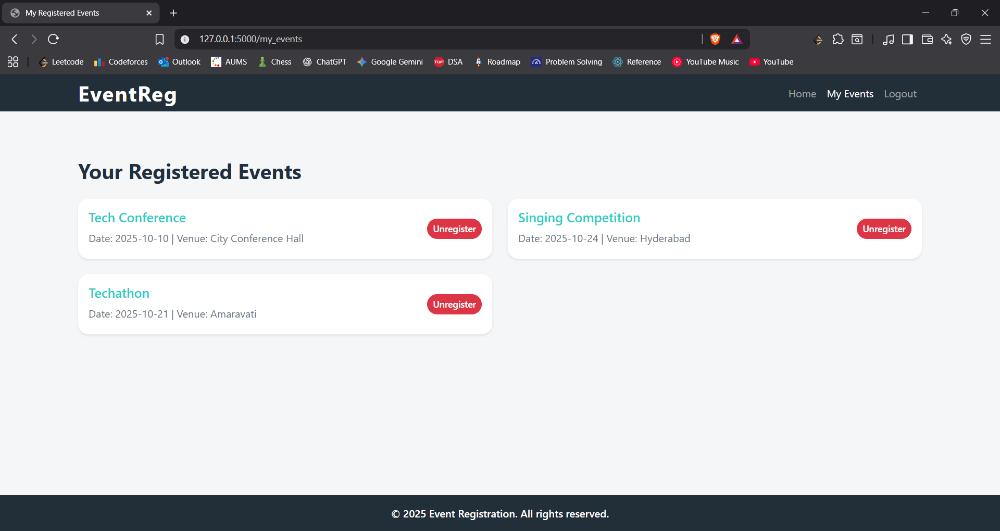

# Event Registration System

## Project Description

The Event Registration System is a web application built with Flask to facilitate the creation, management, and registration for events. Users can register, log in, browse available events, and enroll in them online. Admins can create events, view registrants, and manage event details through an intuitive dashboard. The application features secure user authentication, event registration tracking, and administrative oversight.

## Technologies Used

- Python 3.x
- Flask web framework
- SQLite database
- HTML, CSS, JavaScript (with Bootstrap 5 for UI)
- Werkzeug for password hashing
- python-dotenv for environment variable management

## Setup Instructions

### Prerequisites

- Python 3.7 or higher installed
- Git (optional for cloning the repo)
- SQLite (optional for managing the database file)

### Steps to Run

1. **Clone the repository (or download source code):**
```bash
git clone https://github.com/Sricharan-V/event_registration.git
cd event_registration
```


2. **Create and activate a virtual environment:**

For Windows (PowerShell):
```bash
python -m venv venv
venv\Scripts\activate
```


For macOS/Linux:
```bash
python3 -m venv venv
source venv/bin/activate
```


3. **Install dependencies:**
```bash
pip install -r requirements.txt
```

4. **Set up environment variables:**

Create a `.env` file in project root and add:
```
SECRET_KEY=your_secret_key_here
ADMIN_PASSWORD=your_admin_password_here
```


5. **Initialize the database:**

Run the database initialization script(Only use it again if you want the complete database to be reset):
```bash
python init_db.py
```

6. **Run the Flask app:**
```bash
python app.py
```
or
```bash
flask run
```

7. **Access the application:**

Open [http://localhost:5000](http://localhost:5000) in your browser.


## Features

### User-Focused Features

- **Seamless User Registration:** New users can easily sign up by providing a username, email, and password. If the username already exists you will get back to registration screen again.
    
  
  
- **Robust Login System:** Secure login system with validation. If the username already exists, an error is shown. Similarly, incorrect passwords and non-existent usernames generate clear error messages to guide users.  
  
  
    
  
- **Home Screen with Event Listings:** After login, users are directed to a home screen displaying all upcoming events with details such as date, time, venue, and description.  
    
  
- **Empty State Messaging:** If no events are available, the home screen gracefully displays a message like “No events available at the moment.”  
    
  
- **Register for Events:** Logged-in users can view individual event pages and register for events. If already registered, they are notified and given the option to unregister.  
  
  
- **Unregister Option:** Users can unregister from events, which removes their registration from the database with a single click.  
  
  
- **Success Confirmation:** Users receive clear success messages after registration or unregistration actions.  
    
  
- **My Events Page:** A dedicated page (`/my_events`) displays all events the user has registered for, providing quick access to manage/unregister their registrations.  
    
  
- **Session Management:** Users can securely log out, ending their session.
  
- **Responsive UI:** The entire interface is mobile-friendly and adapts seamlessly to different devices, thanks to Bootstrap 5 styles.  
    
    

---

### Admin-Focused Features

- **Admin Login & Authentication:** Access the admin panel at `/admin`. Attempting to access `/dashboard` redirects unauthenticated users here.  
    
  
- **Admin Dashboard:** View all existing events, add new ones, or modify existing events' details.  
    
  
- **Add & Manage Events:** Admins can create new events, edit existing events, or delete outdated or canceled events.  
    
  
- **Event Registrants Management:** On each event page, the admin can view all registrants. If no one has registered, it displays "No registrants."  
    
  
- **Edit and Remove Registrants:** Admins can update registrant details or delete registrants if necessary.  
    

---

### Notes
- **Navigation:**  
  - `go to /admin` to access the admin panel.  
  - Any attempt to access `/dashboard` without login will redirect to `/admin` login page.